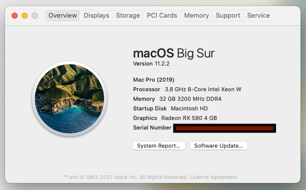

## macOS Monterey?

I've updated to [OpenCore](https://github.com/acidanthera/OpenCorePkg) [0.7.0](https://github.com/acidanthera/OpenCorePkg/releases/tag/0.7.0), but unfortunately you still can't install macOS Monterey on **AMD** CPUs yet. I'll update this readme and the `EFI` files when its possible.

## How I generated the files

- Add base files using https://dortania.github.io/OpenCore-Install-Guide/installer-guide/opencore-efi.html
- Gather files according to https://dortania.github.io/OpenCore-Install-Guide/ktext.html#firmware-drivers
- Follow https://dortania.github.io/OpenCore-Install-Guide/AMD/zen.html#booter
- Fix memory by following https://dortania.github.io/OpenCore-Post-Install/universal/memory.html#mapping-our-memory

## Getting started

- Remember to update your BIOS to the [latest version (Non wifi version, that is the one I am using)](https://www.msi.com/Motherboard/support/MAG-B550M-MORTAR). Without updating this, it did not work. You can do this on any OS, just format a USB to Fat32, and simply unzip the bios update into the root directory. You can select this file in the BIOS menu using the BIOS User interface.
- Configure the BIOS as per [this guide](https://dortania.github.io/OpenCore-Install-Guide/AMD/zen.html#amd-bios-settings), which just means toggle a few settings in the BIOS.
- I installed Windows to ensure the SSD firmware is up to date. I installed Samsung Magician, which informed me my Samsung SSD firmware was up to date. (Not sure if the SSD was sent to me with latest firmware, or the magician updated it for me.)
- Create a big sur USB installer stick
- Prepare the Installer as per the Dortania guide. If you have exactly the same machine config as me, you can just replace the `config.plist/PlatformInfo/Generic/`'s, `MLB`, `ROM`, `SystemSerialNumber`, and `SystemUUID`. You can generate these from SMBios. 

## Highlights (things that took me time to fix)
- No memory errors (fixed using [this](https://dortania.github.io/OpenCore-Post-Install/universal/memory.html#fixing-macpro7-1-memory-errors))
- USB ports and Bluetooth working (fixed using [this](https://dortania.github.io/OpenCore-Post-Install/usb/manual/manual.html))

## Known issues (I won't do these, because I have workarounds and a bit busy this week)
- I have tried all the alcid's for ALC1200 (1, 2, 3, 4, 5, 7, 11, 27, 28, 29)  but wasn't able to get it working. I have monitors which show up as sound outputs, so I just use that instead. 
- Not sure if microphone jack works: I use a bluetooth microphone, so I didn't bother with this. 

## Images

## Parts and Costs (Total: £1316)
All parts are new except for AMD Radeon RX 480 4GB
- AMD Ryzen 7 5800X Processor, £424
- AMD Radeon RX 580 4GB, £210, used
- MSI MAG B550M MORTAR Motherboard AMD Socket AM4, £130
- Cooler Master Hyper 212 Black Edition, £30
- EVGA 600 W1, 80+ WHITE 600W, £43
- fenvi T919 for macOS PC PCI WiFi Card, £60
- Samsung 970 EVO Plus 1 TB, £154
- Corsair Vengeance LPX Black 32GB 3200MHz DDR4 Memory Kit, £130
- PHANTEKS Eclipse P600S E-ATX Mid-Tower PC Case - Gunmetal Grey, £135